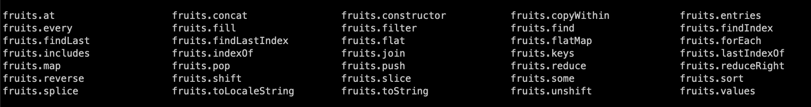

### Functions

Functions are the building blocks for the software. Typically a software would consists of hundreds of small features,
and each of these small feature would be built by one or more small functions. Now lets take a look at a function which checks if an individual has legal age to marry in India.

The legal age for men is above 21 years and for women its 18 years.

```js
function isLegalToMarry(gender, age) {
  if (gender == "male" && age < 21) {
    return false;
  } else if (gender == "male" && age >= 21) {
    return true;
  } else if (gender == "female" && age < 18) {
    return false;
  } else if (gender == "female" && age >= 18) {
    return true;
  } else {
    return false;
  }
}
```

As you can see above, every function takes 0 or more parameters. In this case it accepts two params, age of the individual and gender.

Now let's use ES6 arraow function to declare the above function, which is recommended by functional programmers to write function in a manner that can be composed by larger functions.

```js
const isLegalToMarry = (gender, age) => {
  if (gender == "male" && age < 21) {
    return false;
  } else if (gender == "male" && age >= 21) {
    return true;
  } else if (gender == "female" && age < 18) {
    return false;
  } else if (gender == "female" && age >= 18) {
    return true;
  } else {
    return false;
  }
};
```

#### Assignment 4.1

1. Write an arrow function to find the highest marks. Function definition should be as below.

```
const highestMarks = (math,phy,chem) => ???
```

2. Write an arrow function to get the age of the child, based on the year of birth. Function definition should be as below

```
const ageOfChild = (yearOfBirth) => ???
```

3. Write an arrow function to check if the child is eligible for admission to pre-nursery school, based on the age of the child. The minimum age should be 3 years.

```
const isEligibleForAdmission = (yearOfBirth) => ???
```

4. Write an arrow function to validate the warranty of the mobile based on the purchase date. The warranty is for 18 months.

```
const isWarrantyValid = (purchaseDate) => ???
```

5. Write an arrow function, `calculateAge` to find the age of the person based on yearOfBirth. Then use this function to create another function, checkEligibility if he is eligible for entrance examination for civil services, given the age range of 21 to 30 years.

6. Re-write the above function to take the `calculateAge` function as a parameter.

7. Given the yearOfBirth and age of retirement as 60 years, write a function, `getRetirementYear` to get the year of retirement.

8. Create functions - add, multiply, substract and divide and then use these functions in another function `calculator` that takes 3 parameters - `a (number)`, `b (number)` and operation name(string) which can be `add, substract, multiply and divide`

### Array functions

There are number of methods defined on the array object like `map`, `flatMap`, `filter` and many more that takes function as a parameter.

Lets look at the filter function, that only displays those fruits that starts with 'o'.

```js
let fruits = ["apple", "orange"];

//find all the fruits that start with 'o'
fruits.filter((f) => f.startsWith("o"));
```

Here the anonymous function `f => f.startsWith('o')` is passed as parameter to the filter function, that executes it for every element in the array.

#### Assignment 4.2

Now use all the methods listed below in the screenshot with complete explaination.



#### Assignment 4.3

1. Create an array `marks` that stores the marks of a student in all the subjects. Convert the this array of marks to an array of `grades` based on the following rule.

   a. Grade 'A' for marks between 80 and 100

   b. Grade B for marks between 60 and 80

   c. Grade C for marks between 40 and 60

   d. Grade 'D' for marks below 40

   Example:
   let marks = [23,45,67,65,87,90]
   then grades should be ['D','C','B','A', 'A']

2. Create an array of array to store the marks scored in all the subjects in all the 8 semesters of an engineering program and then merge all the marks and calculate the grades based on the above grades rule.

### Understanding Objects

Objects consist of primitive data types and also other objects. Lets look at an example of student

```js
let student = {
  name: "Shad",
  age: 30,
  marks: [34, 67, 87, 90],
  bornDate: new Date(2000, 10, 10),
  sayHello: () => console.log("Hello objects"),
};
```

Every object has attributes and methods defined and each of this attributes/methods can be accessed using the dot, as shown below.

```js
> student.name
'Shad'

> student.marks
[34,67,87,90]

```

The properties - (attributes / methods) can also be accessed using the field name specified in the bracket as shown below.

```js
> student['marks']
[ 34, 67, 87, 90 ]
```

#### Assignment 4.4

1. Create multiple objects of type item, which has the following properties:

   - itemName(string)

   - itemPrice(number)

   - orderCount(number)

   Create a variable `items` that will store all the item objects created in the previous step.

   - Find the items whose price is greater than 1000.

   - Find the item which has the most number of orders.

   - Sort the items in ascending order of its price.

   - Transform the items array into a list of items which has only two attributes - itemName and itemPrice.

2. Create mulitple objects of type medicine, which has the following properties -

   - medName

   - medPurchaseDate

   - medExpiryDate

   - medPrice

   Create a variable `meds` that will store all the item objects created in the previous step.

   - Find the meds whose price is greater than 1000.

   - Find the medicine which was purchased latest.

   - Sort the items in ascending order of its expiry date.

   - Filter the medicine which has crossed the expiry date.

   - Find the medicine which has the least price.
